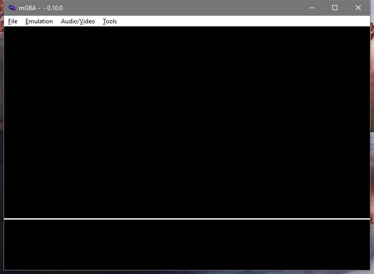

# User Input

So far we can build a program that shows a white screen, or a program that shows a black screen.
As fascinating as this is, we can't even make the program switch from white to black while it's running.
That will be our goal for this part.

For this article we'll be mostly working on a new example: `ex2.rs`

## Memory Mapped Input/Output (MMIO)

At the end of the last article I told you to put a mysterious bit of assembly into the program

```arm
mov r0, #0x04000000
mov r1, #0
strh r1, [r0]
```

This "resets the forced blank bit", and that lets the display show the normal picture instead of all white.
At the moment our normal picture is all black, but soon it will be something else.

What's happening is called Memory Mapped Input/Output, or Memory Mapped IO, or even just MMIO.

The CPU only knows how to do math and access memory.
What "accessing memory" actually means is that a signal goes along a "bus".
The signal can be pushed out to other hardware ("store"), or be pulled in from the other hardware ("load").
When the signal's address points a memory device it's how we store data for later.
There's also other types of device too, things that don't just store data.
When the signal goes there, "other stuff" happens.

The address `0x04000000` connects to a part of the display system called the Display Control.
When we set the display control's bits to `0_u16` with our `strh` instruction, that includes the forced blank bit.
There's other bits too, which we'll get to soon.

All of the GBA's hardware is controlled via MMIO,
so most of this series will involve explaining MMIO address values and the correct way to set ths bits at each address.

Note that an MMIO address is *not* like normal memory:

* Sometimes an address will be read-only (writes are totally ignored) or write-only (reading produces garbage data).
* Sometimes an address will allow both reads and writes, but what you read back will be something else from what you last wrote.
* This is *not* the case with any of the GBA's MMIO, but on some other devices (eg: the NES) reading an MMIO location can be "destructive", changing the value just by reading it.

## Volatile Memory Access

Normally the compiler will try to keep memory accesses to a minimum.
If it sees you read an address twice without a write in between, it'll (usually) only do the read once.
If you write to an address twice without a read in between it'll (usually) skip the first read.
It's simple stuff, but it makes programs fast, and we want our programs fast.

However, when working with MMIO every single memory access has to happen *exactly* as we write it in our program.
If we're (for example) reading the address for the button data then *of course* we'd read it over and over without ever doing a write.
But we still need every single read to actually happen so we can get the newest button data.

To tell the compiler this, we use a "volatile" load or store instead of a normal load or store.
This is done with the [read_volatile](https://doc.rust-lang.org/nightly/std/primitive.pointer.html#method.read_volatile) and [write_volatile](https://doc.rust-lang.org/nightly/std/primitive.pointer.html#method.write_volatile) pointer methods.
But those are `unsafe` methods because the compiler naturally doesn't know if, for any given pointer, it's safe to just read or write some data.
Pointers can come from anywhere, they might be dangling, etc etc, all the normal problems with raw pointers.

Instead, we'll use the [voladdress](https://docs.rs/voladdress) crate.
It's got some alternatives to just raw points that ease the volatile usage quite a bit.
I made it specifically to power the `gba` crate's MMIO, so we can be *fairly confident* that it'll be useful for writing GBA programs.

```
> cargo add voladdress
    Updating crates.io index
      Adding voladdress v1.3.0 to dependencies.
```

Now in our `lib.rs` we can declare `DISPCNT`.
That's the short name that [GBATEK](https://problemkaputt.de/gbatek.htm) (the main GBA homebrew manual) and mGBA use for the display control.
In Rust terms it's a [VolAddress](https://docs.rs/voladdress/latest/voladdress/struct.VolAddress.html) for a `u16` value.
It's safe to read or write, and it's located at `0x0400_0000` like we saw before.

```rust
use voladdress::{Safe, VolAddress};

pub const DISPCNT: VolAddress<u16, Safe, Safe> =
  unsafe { VolAddress::new(0x0400_0000) };
```

Now we can adjust the display control within Rust.
Neato.

## Moving `_start` Into The Library

When we made `ex1.rs` we put the `_start` function directly into the example file.
That's not a great long term plan.
We want to have a `_start` function that just does the correct startup "in the background", automatically.
We don't want to be thinking about it again with each new example we make.

So first let's copy the `_start` function into `lib.rs`.
This will require us to put `#![feature(naked_functions)]` at the top of `lib.rs`.
Again, we *could* use global assembly instead, but I think that global assembly is just a little worse than naked functions, and we're already on Nightly.

Now all of our examples moving forward will have the `_start` function (assuming they link in our library).
That's fine, except that right now `_start` doesn't have a way to call any function in our executable.

We're gonna rewrite `_start` to do whatever startup it needs and *then* we'll have it call another function.
If we pick an un-mangled name for the function that `_start` calls each executable we make will be able to make a function with that name and the linker will weave it all together just fine.
Since it's the conventional "beginning of the program" name let's use `main`.

First we update `_start`:

```rust
// in lib.rs
#[naked]
#[no_mangle]
#[instruction_set(arm::a32)]
#[link_section = ".text._start"]
unsafe extern "C" fn _start() -> ! {
  core::arch::asm! {
    "b 1f",
    ".space 0xE0",
    "1:",
    "ldr r12, =main",
    "bx r12",
    options(noreturn)
  }
}
```

Our new assembly is this part:

```arm
ldr r12, =main
bx r12
```

The first line, `ldr <reg>, =symbol`, is a special "pseudo instruction".
It looks like an instruction, but what the assembler actually outputs is a slight variation.
What will happen is that the assembler will insert a load operation for an address relative to this instruction, and then at that relative address the assembler will also insert the address of `main` itself.
This way we don't have to know where `main` is.
In fact we don't even have to have defined `main` at all.
That's good, because our library won't define `main` anyway.
As long as the final executable defines `main` *somewhere* the linker will patch it all together.

The second line `bx <reg>` is a "branch-exchange".
This is a special kind of branch that we have to use with ARMv4T when we want to switch between ARM code (a32) and Thumb code (t32).
It switches to the correct code mode as part of the jumping the program's execution to the new address.
The `_start` function *must* be written in a32 code, but most of the rest of the program, including `main`, could be written in either code type.
Since `main` might be a different code type from `_start` we use `bx` instead of the basic `b` instruction we've been using previously.
(note: there's a third type of branch on the GBA called `bl`, which we'll see eventually).

While `b` instruction jumped to a *label*, `bx` jumps to a *register*.
That's why we have to load `main` into `r12` before we can use `bx`.
I picked `r12` in this case just because the convention is that it's a "scratch" register.
With the C ABI the caller will never pass data through `r12`, and functions are allowed to modify `r12` without restoring the value before they return.

That's all that `_start` has to do for now.
Later it will have some setup work to do before calling `main`, but not yet.

## Adding `main` To `ex2.rs`

Now in `ex2.rs` we need to have a `main` function that's `no_mangle`, `extern "C"`, and that doesn't ever return.

To begin, we'll make the actual body of `main` just do what we were doing before.
First write 0 to `DISPCNT`, and then do a `loop` forever.

```rust
// ex2.rs
#![no_std]
#![no_main]

use gba_from_scratch::DISPCNT;

#[no_mangle]
pub extern "C" fn main() -> ! {
  DISPCNT.write(0);
  loop {}
}

#[panic_handler]
fn panic_handler(_: &core::panic::PanicInfo) -> ! {
  loop {}
}
```

And if we run this in mGBA with `cargo run --example ex2` we see... actually we see a mostly black screen but with a white line on it.



That's... not what we expected?
That's not either of the types of screen that we got before.
Here's where things get kinda weird.
If we run our program in `--release` mode we *don't* see the line.

Let's look at the output of the compiler again with `objdump`.
In fact, now that we've got more than one example let's have a script to store that "use objdump" stuff.
I'm gonna make a `dump.bat`, but you can make `dump.sh` if you're on Mac or Linux.
It's just a few plain commands, no special scripting.

```bat
cargo build --examples

arm-none-eabi-objdump target/thumbv4t-none-eabi/debug/examples/ex1 --section-headers --disassemble --demangle --architecture=armv4t --no-show-raw-insn -Mreg-names-std >target/ex1.txt

arm-none-eabi-objdump target/thumbv4t-none-eabi/debug/examples/ex2 --section-headers --disassemble --demangle --architecture=armv4t --no-show-raw-insn -Mreg-names-std >target/ex2.txt
```

Okay, and the `target/ex1.txt` file has about what we expect in it. A bunch of sections like we saw before and then.

```txt
Disassembly of section .text:

08000000 <_start>:
 8000000:	b	80000e4 <_start+0xe4>
	...
 80000e4:	mov	r0, #67108864	; 0x4000000
 80000e8:	mov	r1, #0
 80000ec:	strh	r1, [r0]
 80000f0:	b	80000f0 <_start+0xf0>
 80000f4:	udf	#65006	; 0xfdee
```

Yep, just what we expected.

Let's see what's in `target/ex2.txt`, same basic thing, right?
Ah, wait, well there's 29 sections instead of 12.
That's probably fine, more debug info or something, probably?
Won't affect our code, I'm sure.

```txt
Disassembly of section .text:

08000000 <_start>:
 8000000:	b	80000e4 <_start+0xe4>
	...
 80000e4:	ldr	r12, [pc, #4]	; 80000f0 <_start+0xf0>
 80000e8:	bx	r12
 80000ec:	udf	#65006	; 0xfdee
 80000f0:	.word	0x08000115
```

Sure, what we expected...

```txt
080000f4 <voladdress::voladdress_::VolAddress<T,R,voladdress::Safe>::write>:
 80000f4:	push	{r7, lr}
 80000f6:	sub	sp, #16
 80000f8:	str	r1, [sp, #4]
 80000fa:	str	r0, [sp, #8]
 80000fc:	add	r2, sp, #12
 80000fe:	strh	r1, [r2, #0]
 8000100:	bl	8000178 <core::num::nonzero::NonZeroUsize::get>
 8000104:	ldr	r1, [sp, #4]
 8000106:	bl	800012c <core::ptr::write_volatile>
 800010a:	add	sp, #16
 800010c:	pop	{r7}
 800010e:	pop	{r0}
 8000110:	mov	lr, r0
 8000112:	bx	lr
```

Oops.. that's... not a good way to write to a pointer.

```txt
08000114 <main>:
 8000114:	movs	r0, #1
 8000116:	lsls	r0, r0, #26
 8000118:	movs	r1, #0
 800011a:	bl	80000f4 <voladdress::voladdress_::VolAddress<T,R,voladdress::Safe>::write>
 800011e:	b.n	8000120 <main+0xc>
 8000120:	b.n	8000120 <main+0xc>
```

Oh?

```txt
08000122 <rust_begin_unwind>:
 8000122:	sub	sp, #4
 8000124:	str	r0, [sp, #0]
 8000126:	b.n	8000128 <rust_begin_unwind+0x6>
 8000128:	b.n	8000128 <rust_begin_unwind+0x6>
 800012a:	bmi.n	80000d6 <_start+0xd6>
```

Okay that one seems okay, I think?

```txt
0800012c <core::ptr::write_volatile>:
 800012c:	push	{r7, lr}
 800012e:	sub	sp, #24
 8000130:	str	r0, [sp, #0]
 8000132:	movs	r2, r1
 8000134:	str	r2, [sp, #4]
 8000136:	str	r0, [sp, #12]
 8000138:	add	r0, sp, #16
 800013a:	strh	r1, [r0, #0]
 800013c:	movs	r0, #1
 800013e:	cmp	r0, #0
 8000140:	bne.n	8000154 <core::ptr::write_volatile+0x28>
 8000142:	b.n	8000144 <core::ptr::write_volatile+0x18>
 8000144:	ldr	r0, [sp, #4]
 8000146:	ldr	r1, [sp, #0]
 8000148:	strh	r0, [r1, #0]
 800014a:	add	sp, #24
 800014c:	pop	{r7}
 800014e:	pop	{r0}
 8000150:	mov	lr, r0
 8000152:	bx	lr
 8000154:	ldr	r0, [sp, #0]
 8000156:	str	r0, [sp, #8]
 8000158:	ldr	r0, [sp, #8]
 800015a:	str	r0, [sp, #20]
 800015c:	bl	8000180 <core::intrinsics::is_aligned_and_not_null>
 8000160:	cmp	r0, #0
 8000162:	bne.n	8000170 <core::ptr::write_volatile+0x44>
 8000164:	b.n	8000166 <core::ptr::write_volatile+0x3a>
 8000166:	ldr	r0, [pc, #12]	; (8000174 <core::ptr::write_volatile+0x48>)
 8000168:	movs	r1, #111	; 0x6f
 800016a:	bl	80002fc <core::panicking::panic_nounwind>
 800016e:	udf	#254	; 0xfe
 8000170:	b.n	8000144 <core::ptr::write_volatile+0x18>
 8000172:	nop			; (mov r8, r8)
 8000174:	.word	0x08000440
```

Oh... uh... oh no.
And there's more.
It goes on and on, but I think you get the joke at this point.

Yeah, `rustc` outputs *utter garbage* code without optimizations enabled.
Just, atrocious.
The only reason it's usable at all on your desktop is because modern computers are so fast.

Our best bet is to just turn on full optimizations for the debug profile.
This can be done in `Cargo.toml`.
In a new `profile.dev` section we set the `opt-level` to 3.

```toml
[profile.dev]
opt-level = 3
```

And rebuild / redump the program:

```txt
Disassembly of section .text:

08000000 <_start>:
 8000000:	b	80000e4 <_start+0xe4>
	...
 80000e4:	ldr	r12, [pc, #4]	; 80000f0 <_start+0xf0>
 80000e8:	bx	r12
 80000ec:	udf	#65006	; 0xfdee
 80000f0:	.word	0x080000f5

080000f4 <main>:
 80000f4:	movs	r0, #1
 80000f6:	lsls	r0, r0, #26
 80000f8:	movs	r1, #0
 80000fa:	strh	r1, [r0, #0]
 80000fc:	b.n	80000fc <main+0x8>
```

That's it, that's our whole program once optimizations have been applied.
Now we don't get the white line.

Why did we get it before?
I don't know exactly.
Our `ex2` program "stops" on an infinite loop that's just as fast as the `ex1` version, even if it takes longer to get there.
I'd have thought that it wouldn't make a difference, but somehow it does.
Emulators are weird like that sometimes.

Oh, and speaking of weird stuff, while we're adjusting build configuration things, I found out about that undefined instruction thing.
Our good friend Scott wrote in (so to speak) and suggested trying `-Ztrap-unreachable=no` in RUSTFLAGS.

So we just add it in the `.cargo/config.toml`:

```toml
[target.thumbv4t-none-eabi]
rustflags = ["-Ztrap-unreachable=no", "-Clink-arg=-Tlinker_scripts/normal_boot.ld"]
runner = "mgba-qt"
```

and rebuild / redump again...

```txt
Disassembly of section .text:

08000000 <_start>:
 8000000:	b	80000e4 <_start+0xe4>
	...
 80000e4:	ldr	r12, [pc]	; 80000ec <_start+0xec>
 80000e8:	bx	r12
 80000ec:	.word	0x080000f1

080000f0 <main>:
 80000f0:	movs	r0, #1
 80000f2:	lsls	r0, r0, #26
 80000f4:	movs	r1, #0
 80000f6:	strh	r1, [r0, #0]
 80000f8:	b.n	80000f8 <main+0x8>
```

The undefined instruction is gone!
Magical!
I guess the explanation is that LLVM is trying to add in a "guard" against code accidentally flowing past the end of the function.
When the CPU is made to execute and undefined instruction it causes a special kind of "interrupt" to happen.
We'll mostly talk about interrupts later, but for now let's just say that what LLVM is *expecting* is that the Operating System will handle the interrupt by killing the program (the undefined instruction "traps" your program).
We don't really have an OS on the GBA, we *are* the OS you might say.
Regardless of what you call it, that undefined instruction won't "trap" like LLVM thinks it will.
The undefined interrupt handler in the BIOS just returns and the device just keeps executing.
So that undefined instruction is purely a waste of space to us.

We might as well leave `-Ztrap-unreachable=no` set in our configuration.
The `-Z` part means that it's a Nightly flag, but we're on Nightly for other stuff already so it's fine.
If we have to be on Nightly for `build-std`, we might as well take advantage of the other extra flags we can.

## More Assembly Details

Let's quickly take another close look at our two functions so far.

First is `_start`

```arm
08000000 <_start>:
 8000000:	b	80000e4 <_start+0xe4>
	...
 80000e4:	ldr	r12, [pc]	; 80000ec <_start+0xec>
 80000e8:	bx	r12
 80000ec:	.word	0x080000f1
```

So the `ldr r12, =main` has become `ldr	r12, [pc]`.
The `pc` register is the "program counter".
That's storing the next address for the CPU to read and start doing an instruction.
The ARM7TDMI has a 3 stage CPU pipeline: Fetch, Decode, Execute.
The `pc` register will always be pointing *two instructions* ahead of what instruction is actually executing.
So by the time we're executing the `ldr`, the `pc` register is two instructions ahead on `.word	0x080000f1`.
The `.word` directive inserts a literal 4 byte value, in this case `0x080000f1`.
That's the address of `main`, +1.
The +1 part makes the address odd, which is how `bx` will know what code state to switch to.

So after we load an address into `r12`, we use `bx` to branch-exchange to that address.
The "exchange" part is because there's a register called the "current program status register".
This register holds several bit flags about the program's current status.
Importantly it has a T flag, which says if the CPU is running in thumb state or not.
A branch-exchange will "exchange" the lowest bit in the register holding the target address with the current value of the T flag.

* If the target address is odd then the T flag becomes set (the program will run as thumb code).
* If the target address is even then the T flag becomes cleared (the program will run as arm code).

And I know it's an "exchange", but the *previous* T value basically goes nowhere.
They just call it an exchange to give it a fancy name, I guess.

I hope that wasn't too much.
If not, don't worry.
It's not essential to understand the full details right away if you want to just keep going.

Let's look over at `main`.

```arm
080000f0 <main>:
 80000f0:	movs	r0, #1
 80000f2:	lsls	r0, r0, #26
 80000f4:	movs	r1, #0
 80000f6:	strh	r1, [r0, #0]
 80000f8:	b.n	80000f8 <main+0x8>
```

Ah, here's something interesting.
Instead of `mov` we're doing `movs`, and instead of `lsl` (logical shift left) we're doing `lsls`.
When an instruction ends with `s` then it "sets the status flags".

* `_start` is ARM code, and most all ARM instructions can choose to set the flags or not. We haven't set the status flags in our small amount of code so far.
* `main` is thumb code, and most all thumb instructions are forced to set the flags. This constraints how much you can reorder your instructions. Each operation that sets flags you care about has to come *just before* whatever the thing using those flags is.

But let's notice something else.
We can see the addresses of each instruction, and in `_start` we can see each instruction is 4 bytes.
With `main` we can see that each instruction is just 2 bytes.
This is the advantage of using thumb code.
The program is significantly smaller.

In fact, the CPU has to access ROM over a 16-bit bus.
This means that if the CPU needs a 32-bit value (such as an ARM instruction) then it needs to do two reads in a row to get the complete data.
This means that when running programs out of ROM they actually run slower if they're ARM code.
The CPU will have to wait over and over as it tries to get each complete instruction just half an instruction at a time.
This is why we're having the default encoding for our program be thumb code.

Also, the way to get `0x0400_0000` into a register has changed:

* With ARM code we can `mov` the value directly as one instruction.
* With thumb code we have to `movs` a 1 and then as a separate step we left shift it by 26 bits to get the right value.

What's happening is that the ARM `mov` instruction *doesn't* encode the full litearal `0x0400_0000` within the instruction.
It's only a 32 bit instruction, so it can't store a 32 bit value and *also* the bits to declare `mov`.
Instead, it stores `mov` and a compressed form of the data: `1<<26`.
But thumb code is only 16 bits, so it can't even store that much.
Since each thumb instruction is only 2 bytes instead of 4, there's less bits to fit immediate values and do instruction variations and such.
This means that in a lot of cases an operation that's one ARM instruction will be more than one thumb instruction.
Because of this, thumb code vs ARM code is *not* as simple as "your program is half as big".
You get a significant savings on average, but the exact ratio depends on the program

We can see the disassembler is showing our `strh` as `strh	r1, [r0, #0]`.
This is saying "`r0` plus 0".
Actually any store or load can be "plus some immediate value", but when the modifier is plus 0 we don't need to write it.
In this case, the disassembler is just being a little silly in how it prints things.

Also, when we see `b.n	80000f8`, this `b.n` means "branch instruction with narrow encoding".
The explanation here is that in later versions of ARM there was a "thumb 2" introduced.
In thumb 2, some instructions will be encoded as one opcode (each of which is two bytes), but then other uses will be two opcodes.
The `.n` is the "narrow" encoding, meaning it's the one opcode version.
On the GBA we don't use thumb2 at all, but since the `objdump` program is designed to work with all versions of ARM it just prints this way.

## The Backdrop Color

The "backdrop" color is the color that's shown in a pixel if no background layer or object is visible in that pixel.
Right now when we turn off forced blank we see a black screen because the backdrop color is black.
If we were to change the backdrop color we'd see the whole screen filled with some other color.

First let's declare an MMIO for the backdrop color.

```rust
// in lib.rs
pub const BACKDROP: VolAddress<u16, Safe, Safe> =
  unsafe { VolAddress::new(0x0500_0000) };
```

Now let's update `ex2.rs` so that we set the backdrop color before we turn off forced blank.

```rust
// in ex2.rs
use gba_from_scratch::{BACKDROP, DISPCNT};

#[no_mangle]
pub extern "C" fn main() -> ! {
  BACKDROP.write(0b11111);
  DISPCNT.write(0);
  loop {}
}
```

Let's look at that assembly:

```arm
080000f0 <main>:
 80000f0:	movs	r0, #5
 80000f2:	lsls	r0, r0, #24
 80000f4:	movs	r1, #31
 80000f6:	strh	r1, [r0, #0]
 80000f8:	movs	r0, #1
 80000fa:	lsls	r0, r0, #26
 80000fc:	movs	r1, #0
 80000fe:	strh	r1, [r0, #0]
 8000100:	b.n	8000100 <main+0x10>
```

So first it gets the `BACKDROP` address in a register (5<<24), then the color value (31), then writes that, and the rest of the program is like we've seen before.
Makes sense.

We *could* also change the backdrop color after turning off forced blank if we wanted to.
However, by default it's best practice to only adjust the display when forced blank is on or when you know it's the vertical blank period.
Otherwise you can get accidental display artifacts on the screen.

If we run the program now we'll see a red screen.

The magic looking `0b11111` value is because the GBA has 5-bit per channel color.
A GBA color value is a `u16` with the channels going from low to high:

```
0bX_BBBBB_GGGGG_RRRRR
```

So `0b11111` is "full red, no green or blue".

Using a raw `u16` isn't that great.
We'd probably like to have a little bit more meaning to the type so that it's clearer what's going on.
We can put names on our functions and magic values, things like that.

If we replace the `u16` in `BACKDROP` with a `repr(transparent)` wrapper type over an actual `u16` then things will be a lot better.
This is called using a "newtype", and we'll be doing it a lot.

```rust
// in lib.rs
pub const BACKDROP: VolAddress<Color, Safe, Safe> =
  unsafe { VolAddress::new(0x0500_0000) };

#[derive(Clone, Copy, PartialEq, Eq)]
#[repr(transparent)]
pub struct Color(pub u16);
impl Color {
  pub const RED: Self = Self::rgb(31, 0, 0);

  #[inline]
  #[must_use]
  pub const fn rgb(r: u16, g: u16, b: u16) -> Self {
    Self(r | (g << 5) | (b << 10))
  }
}
```

Then we change `ex2.rs` to use our new Color type.

```rust
use gba_from_scratch::{Color, BACKDROP, DISPCNT};

#[no_mangle]
pub extern "C" fn main() -> ! {
  BACKDROP.write(Color::RED);
  DISPCNT.write(0);
  loop {}
}
```

Practically self-documenting code at this point!

If we run the program again we can see a red screen too.
Let's double check our assembly to make sure we didn't kill performance somehow.

```arm
080000f0 <main>:
 80000f0:	movs	r0, #5
 80000f2:	lsls	r0, r0, #24
 80000f4:	movs	r1, #31
 80000f6:	strh	r1, [r0, #0]
 80000f8:	movs	r0, #1
 80000fa:	lsls	r0, r0, #26
 80000fc:	movs	r1, #0
 80000fe:	strh	r1, [r0, #0]
 8000100:	b.n	8000100 <main+0x10>
```

Hey it's the *exact* same as before.
We've got a zero-runtime-cost abstraction, the promise of Rust is real!

## Reading The Buttons

Fun as it is to have a single static color, that's still not very exciting.

We can read the current state of the keys from the `KEYINPUT` control.
This includes both the "buttons" as well as the direction-pad value.

```rust
// in lib.rs
pub const KEYINPUT: VolAddress<u16, Safe, ()> =
  unsafe { VolAddress::new(0x400_0130) };
```

Note that instead of `Safe` as the write type we've put `()` instead.
The key data is naturally write only.
The CPU can't just tell the GBA to make a button be pressed or not.

With this new MMIO we can show a color based on the keys:

```rust
// in ex2.rs
#[no_mangle]
pub extern "C" fn main() -> ! {
  DISPCNT.write(0);
  loop {
    let k = KEYINPUT.read();
    BACKDROP.write(Color(k));
  }
}
```

Now if we run the program and press different keys we'll see the color change.

Each bits of `KEYINPUT` that's connected to a key will be 0 when the key is pressed and 1 when the key is released.
Bits not connected to a key will always just be 0.
Which key controls which bit is as follows:

| Bit | Key |
|:-:|:-|
| 0 | A |
| 1 | B |
| 2 | Select |
| 3 | Start |
| 4 | Right |
| 5 | Left |
| 6 | Up |
| 7 | Down |
| 8 | R |
| 9 | L |

Like with the color data, we probably want to make a newtype for all this.

```rust
// in lib.rs
pub const KEYINPUT: VolAddress<KeyInput, Safe, ()> =
  unsafe { VolAddress::new(0x400_0130) };

#[derive(Clone, Copy, PartialEq, Eq)]
#[repr(transparent)]
pub struct KeyInput(pub u16);
#[rustfmt::skip]
impl KeyInput {
  #[inline]
  pub const fn a(self) -> bool { (self.0 & (1<<0)) == 0 }
  #[inline]
  pub const fn b(self) -> bool { (self.0 & (1<<1)) == 0 }
  #[inline]
  pub const fn select(self) -> bool { (self.0 & (1<<2)) == 0 }
  #[inline]
  pub const fn start(self) -> bool { (self.0 & (1<<3)) == 0 }
  #[inline]
  pub const fn right(self) -> bool { (self.0 & (1<<4)) == 0 }
  #[inline]
  pub const fn left(self) -> bool { (self.0 & (1<<5)) == 0 }
  #[inline]
  pub const fn up(self) -> bool { (self.0 & (1<<6)) == 0 }
  #[inline]
  pub const fn down(self) -> bool { (self.0 & (1<<7)) == 0 }
  #[inline]
  pub const fn r(self) -> bool { (self.0 & (1<<8)) == 0 }
  #[inline]
  pub const fn l(self) -> bool { (self.0 & (1<<9)) == 0 }
}
```

(This is kinda begging for a `macro_rules!`, but it's basically fine to put that off until later.)

Also let's add a definition for `GREEN` on our color type.

```rust
impl Color {
  pub const RED: Self = Self::rgb(31, 0, 0);
  pub const GREEN: Self = Self::rgb(0, 31, 0);
  // ...
}
```

Now we can read the keys, and set the color to red or green based on if a key is pressed or not:

```rust
#[no_mangle]
pub extern "C" fn main() -> ! {
  DISPCNT.write(0);
  loop {
    let k = KEYINPUT.read();
    BACKDROP.write(if k.a() { Color::RED } else { Color::GREEN })
  }
}
```

And I think that's enough for one article.
